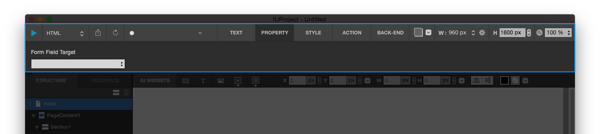
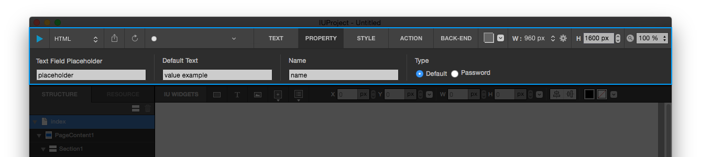
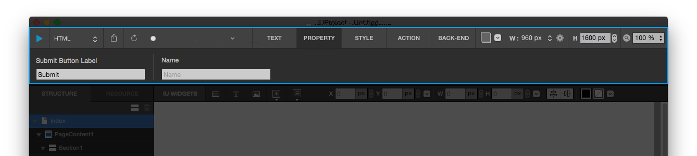
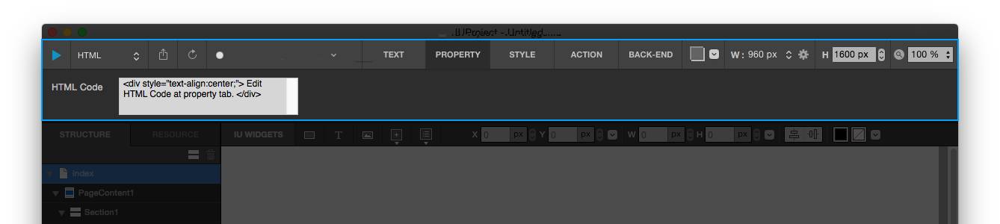

***

# 폼 Form 
  
폼 위젯입니다. 
Input 요소를 감싸주는 &lt;form&gt; 태그 위젯입니다. 따라서, Input 요소를 추가하기 전에 필수로 생성해야 합니다. 
폼 위젯을 먼저 만들고 그 안에 Input 위젯을 넣어주세요.
  

### 속성 
폼 위젯은 아래와 같은 속성을 지닙니다.

* 하위요소 : 가능
* 링크 : 불가능
* 스크롤 애니메이터 : 가능
* 배경이미지 : 가능
* 백엔드 엘립시스 : 불가능

 

***

# 인풋 텍스트 Input Text 
  
인풋 텍스트 위젯입니다. 
Form 위젯에 추가하여 사용자로부터 텍스트를 입력받을수 있습니다.  

### 속성 
인풋 텍스트필드 위젯은 아래와 같은 속성을 지닙니다.

* 하위요소 : 불가능
* 링크 : 가능
* 스크롤 애니메이터 : 가능
* 배경이미지 : 가능
* 백엔드 엘립시스 : 불가능

 

***

# 인풋 패러그래프 텍스트 Input Paragraph Text 
  
인풋 텍스트(문장) 위젯입니다. 
Form 위젯에 추가하여 사용자로부터 텍스트를 입력받을수 있습니다. (긴 문장에 사용)  

### 속성 
인풋 텍스트(문장) 위젯은 아래와 같은 속성을 지닙니다.

* 하위요소 : 불가능
* 링크 : 가능
* 스크롤 애니메이터 : 가능
* 배경이미지 : 가능
* 백엔드 엘립시스 : 불가능
 

***

# 서브밋 버튼 Submit Button 
  
서브밋 버튼 위젯입니다. 
Form에서 입력받은 내용을 전송하는 기능을 담당합니다.

### 속성 
서브밋 버튼 위젯은 아래와 같은 속성을 지닙니다.

* 하위요소 : 불가능
* 링크 : 불가능
* 스크롤 애니메이터 : 가능
* 배경이미지 : 가능
* 백엔드 엘립시스 : 불가능

 

***

# 셀렉트 Select 

***

# HTML 
  
HTML 위젯입니다. 
IUEditor에 원하는 위젯이 없을 경우 직접 HTML 코드를 작성해서 넣을 수 있습니다. 
하지만 원하는 위젯이 있다면 iu@jdalb.org로 의견을 보내주세요!
  

### 속성 
HTML 위젯은 아래와 같은 속성을 지닙니다.

* 하위요소 : 불가능
* 링크 : 불가능
* 스크롤 애니메이터 : 가능
* 배경이미지 : 가능
* 백엔드 엘립시스 : 불가능

 

***

# 콜렉션 Collection 
<!-- Collection Property Image
  
-->
컴포지션을 불러오는 콜렉션 위젯입니다. 
하나의 컴포지션을 반복해서 사용하려고 할때 유용합니다. 한 줄에 몇 개의 컴포지션이 보이게 할지 정할 수 있습니다.

## 속성 
콜렉션 위젯은 아래와 같은 속성을 지닙니다.

* 하위요소 : 불가능
* 링크 : 가능 
* 스크롤 애니메이터 : 가능
* 배경이미지 : 가능
* 백엔드 엘립시스 : 불가능

 

***

# 페이지 넘버 세트 Page Number Set 
<!-- Page Number Set Property Image
  
-->
페이지 넘버 세트를 사용 하는 위젯입니다.  
주로 게시판이나 페이지 세트의 링크를 만들 때 사용합니다.
한 번의 몇개의 숫자를 나타낼 것인지 정할 수 있습니다.

### 속성 
페이지 넘버 세트 위젯은 아래와 같은 속성을 지닙니다.

* 하위요소 : 불가능
* 링크 : 가능 
* 스크롤 애니메이터 : 가능
* 배경이미지 : 가능
* 백엔드 엘립시스 : 불가능

